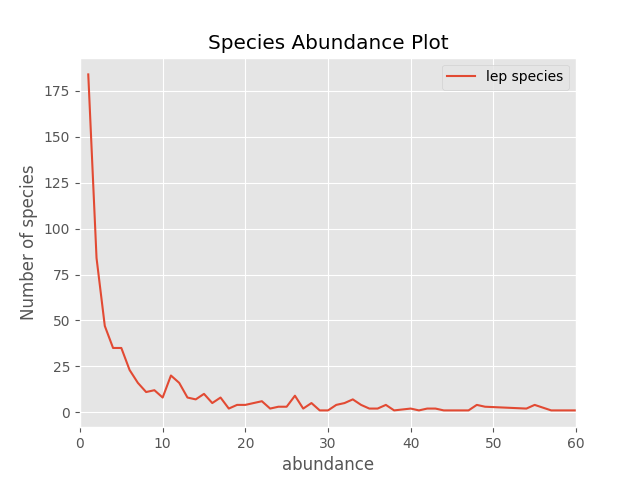
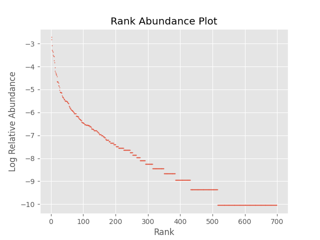
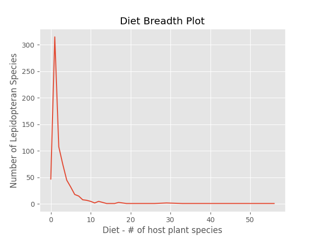

---
output:
  html_document: default
  pdf_document: default
---

# NumPy, pandas, data cleaning and visualization

For this project, we used Pandas and NumPy to clean and extract data from our datasets. We both have rather different study systems and datasets, but we were able to make a couple programs useful for both of us (maybe with a little tweaking). Here, we present our problems and the steps we followed to address those problems, largely in the form of python code. We also present our next steps, both with our data and what else we hope to learn to do with NumPy, pandas, and python.

## Sage has multiple people's specimen catalogs, data on snake TTX resistance in multiple formats, and a host of other unorganized files to extract data from.

I needed two different sets of information from these data sets. First, which specimens collected by our lab and our collaborators were from my study area, and did we have tissue samples, sequencing data, or phenotypes for them? Second, which specimens had phenotypes, base speeds, and at least one out of SVL, mass, and tail length? The first information was used to figure out how many tissue/genetic samples we already had and how many new ones would need to be requested from museums or captured in the field and phenotyped. The second set will be used to model the effects of mass, size, body condition, and TTX resistance on base speed in an attempt to observe a trade-off between resistance and muscle function.

### Part 1: Catalog Searches

My first steps for this project were parsing through several specimen collection catalogs and extracting specimens based on increasingly specific qualifications.

#### extract_couchii.py

The first qualification was species, pulling out all the specimens that were *Th. couchii*, which I did with this script:

``` python
#!/usr/bin/env python3
import sys
import pandas as pd

for file in sys.argv[1:]:  #loop through all files passed to the script
  IN=pd.read_csv(file)    #read file in as a csv
  print(IN.head())        #print out the head mostly for reference/awareness of what files look like; also useful to see if species data is in a column named differently than will be caught by the program
                          
  if ("Sp" in list(IN.columns)): #most common column heading
      Couchii=IN.loc[IN["Sp"].str.strip() == "couchii"]
      Couchii.to_csv("couchii_mamu.csv",index = False,mode='a') #appending because I loop through multiple files
  
  elif ("Species" in list(IN.columns)):
      Couchii2=IN.loc[IN["Species"].str.strip() == "couchii"]
      Couchii2.to_csv("couchii_mamu.csv",index=False, mode='a') #output file name is hardcoded but could easily be changed
  
  elif ("Spp" in list(IN.columns)):
      Couchii3=IN.loc[IN["Spp"].str.strip() == "couchii"]
      Couchii3.to_csv("couchii_mamu.csv",index=False, mode='a')
  
  IN.close() #not completely sure if you have to do this in pandas but it seems like best practices
```

This was the first script I made, and as you can see it was pretty hard-coded. To process multiple files at once, I needed that nested if-else loop because different files had different names for the column with the species name.

#### extractbycol.py

Next, I needed to extract all the specimens from specific counties (Sierra, Nevada, and Placer). I originally did this with another hard-coded script, but then realized I'd likely need to do something like this again and generalized it into a script that pulls out all the observations in a dataframe with a given value in a given column. It allows you to pull based on multiple values of interest, but only processes one file at a time because different files again had different column names and I wasn't sure how to divide up my `sys.argv` inputs.

``` python
#!/usr/bin/env python3
# only works on 1 file at a time
import sys, re
import pandas as pd

df=pd.read_csv(sys.argv[1]) #import input file
out=sys.argv[2] #save name of output file
col=sys.argv[3] #save column we're filtering by

for value in sys.argv[4:]: #loop through all inputted search terms
    fileout=df[df[col].str.contains(value, flags=re.IGNORECASE,na=False)] #pull   rows with the values passed as inputs in the column we specified
    fileout.to_csv(out,mode='a') #set to append because we loop through multiple values of interest
```

I liked being able to specify the name of the output file instead of having it based on the input file name - this isn't implemented in some of the scripts below but that's because they were made first and I didn't think of it at the time.

#### dropduplicates.py

At this point, I had a file with all the *couchii* specimens from 4 different specimen collections. The problem was, some of those specimens were listed in multiple specimen catalogs because they were collected by people in our lab and then sometimes put into my advisor's tissue sample catalog. So, I needed an easy way to remove duplicate observations from my data.

This script allows you to remove duplicates based on values in any column, partially because sometimes the "CollPreNo"/"Specimen ID" column is named differently and partially because sometimes you might only want one observation from each geographic region, or date, or some other metric.

``` python
#!/usr/bin/env python3
import pandas as pd
import sys

df=pd.read_csv(sys.argv[1]) #first input is the file to remove duplicates from
dup_check=str(sys.argv[2]) #second input is the column i want to check for duplicates
df=df.astype({dup_check:str}) #need to make sure that that column is read as a string so that I can strip out/off any whitespace

df[dup_check]=df[dup_check].str.replace(" ","") #remove whitespace
uniq_df=df.drop_duplicates(subset=[dup_check],keep='first') #remove duplicates and keep the first instance (could make that a separate argument if I wanted)
uniq_df.to_csv("noduplicates_"+sys.argv[1],index=False) #write to csv with a descriptvie prefix and the original name of the file
```

After this, I extracted all the specimens that we had phenotypes for (based on if their ID appeared in two files that listed almost all the phenotypes we had). I foolishly over-wrote that script when adapting it into something similar, so I can't show it here, but it worked similarly to extractbycol and the script below.

#### checkmamu.py (making sure there wasn't new data in new mamu files)

A little while after I did that, my advisor sent me more data files with phenotypes to confirm that there weren't any that didn't make it into the masterdoc. I built the below program to go through all those files and compare them with the list of specimens with phenotypes I already had and make sure I hadn't missed any. I did this by finding all the specimens in my document of *Th. couchii* from my study area that appeared in these phenotype files and then comparing them to my list of specimens we had phenotypes for ("specimens_to_find.csv" in the code below). Those that were missing had their IDs written to a text file. I manually copied over their information because the code was already kind of long and messy, and there were ultimately only 5 specimens missing.

``` python
#!/usr/bin/env python3
import pandas as pd
import sys

df=pd.read_csv(sys.argv[1],header=0) #read in the file to make the checks on
PreNo=str(sys.argv[2]) #give name of column with specimen ID info
df2=pd.read_csv(sys.argv[3],header=0) #read in file for the first check (in this context it was the file with all the snakes from my study area)
PreNo2=str(sys.argv[4]) #column name for the first check
df3=pd.read_csv("../specimens_to_find.csv",header=0) #read in file for the second check (hardcoded here to be whether the specimen is already on my list)
PreNo3="Collector #" #hard-coded column name for the second check

df[PreNo]=df[PreNo].str.replace(" ","") #strip white space
df2[PreNo2]=df2[PreNo2].str.replace(" ","") #strip white space
df=df.assign(ChkCounty=df[PreNo].isin(df2[PreNo2]).astype(int)) #column for if each entry is in first vector
df=df.assign(ChkOld=df[PreNo].isin(df3[PreNo3]).astype(int)) #column for if each entry is in second file

OUT=open("new_mamus.txt",mode='a') #open output txt file

for _, row in df.iterrows(): #very cursed way of doing this, I wouldn't do this now
    if row['ChkCounty'] == 1: #if it's in the first file
        if row['ChkOld']==0: #and not in the second file
            OUT.write(str(row[PreNo])+"\n") #add its ID to the output file

OUT.close() #close output file
```

This is not remotely how I would solve this problem anymore, but this was before learning more about pandas either on my own or in class, so it was the best I could come up with. I don't need this program anymore because shortly afterwards we decided to include samples that didn't have phenotypes, so I didn't bother updating it. I figure leaving it like this is good evidence of how much better I've gotten at python and pandas over the course of this project and this semester.

#### mamuchk.py

Once we knew we wanted specimens with and without phenotypes, and after adding another county to our study area, I needed to go back over my data and find a way to easily add a column that indicated if we did or did not have a phenotype. This program (with a name admittedly too close to the previous program), does that. It does have the phenotype files hard-coded in because I didn't (and still don't) anticipate using it for anything else, and I find programs with too many inputs difficult to keep track of and call correctly (see future goals section for a proposed solution to this).

``` python
#!/usr/bin/env python3
import pandas as pd
import sys

df=pd.read_csv(sys.argv[1],header=0) #read in file to check for phenotypes
PreNo=str(sys.argv[2]) #column of specimen ID (or other thing to check using)
df2=pd.read_csv("old_MAMUs.csv",header=0) #hard-coded but could be adapted to arg
df3=pd.read_csv("KER_MAMU_101923.csv",header=0) #same as above

df[PreNo]=df[PreNo].str.replace(" ","") #strip white space from all 3
df2['ID']=df2['ID'].str.replace(" ","")
df3['ID']=df3['ID'].str.replace(" ","")

df=df.assign(ChkOld=df[PreNo].isin(df2['ID']).astype(int)) #similar to previous script, column with value for if it was in first file
df=df.assign(ChkNew=df[PreNo].isin(df3['ID']).astype(int)) #as above, second file

df['MAMU'] = df['ChkOld'] #add a new column to the data frame by duplicating (odd way to do this in hindsight)
df['MAMU'] = "n" #set default value as n
df.loc[df['ChkOld'] == 1, 'MAMU'] = "y" #assign it y if in first file
df.loc[df['ChkNew'] == 1, 'MAMU'] = "y" #assign it y if in second file

df.to_csv(sys.argv[1]+"_mamudat.csv",index=False,mode='w') #output to file with suffix showing it's been modified by this program
```

Again, this was probably not the most efficient way to do this, especially with the creation of two extra columns, but it worked and that was good enough for my purposes at the time. If I were to do it again, I'd store the 'ChkOld' and 'ChkNew' values internally and not actually add them to the file, and make it less hard-coded so it's adaptable for other data (such as whether or not there's lat-long data, if we know what watershed it was, juvenile/adult, etc.)

#### The Output

At the end of all this (and some other manipulations I didn't show), I had a file with all the specimens of *Th. couchii* from my study area (El Dorado, Placer, Sierra, and Nevada counties) and a column showing whether or not we had a phenotype (MAMU) for each specimen. I also added columns for whether or not we have DNA extractions or DNA sequences for each specimen by a similar process; that code not shown here for the sake of space. The head of that file is shown here:

```{r echo=FALSE}
specimendata <- read.csv("specimen_masterlist.csv")
head(specimendata)
```

### Part 2: Compiling Old Data

My other big goal for this project was to go through some other, much older data files and extract all the relevant information while combining them into one file. This was inconvenient only because the files all had very mismatched columns, and because many of the entries were missing data I needed (so I didn't want the entries if they didn't have that data). It was overall a much less complicated process than the first goal, partially because I had gotten better about hard-coding everything and partially because I eventually gave up on my goal of using regular expressions to align similarly named columns (see future goals section).

#### concat_keepsetcols.py

I actually did this all in one program (yay efficiency!), which takes a few arguments: the number of files you're passing to it, the files, and the names of the columns you want to keep for the final output. That was important because there was a lot of information in these files I didn't need in my output file, and it was easier to say which to keep than manually delete all those extra columns.

``` python
#!/usr/bin/env python3
import sys
import pandas as pd
import numpy as np

concat_df = pd.DataFrame() #initialize an empty df to combine everything into

numfiles=int(sys.argv[1]) #first argument if number of files
fileend=numfiles+2 #and that is used to figure out how to index through sys.argv
for file in sys.argv[2:fileend]: #loop through every file
    df=pd.read_csv(file,dtype=str) #read in file as data frame
    concat_df = pd.concat([concat_df,df],ignore_index=True) #concatenate by column, adding new columns every time a new one is introduced, and putting NA for any entries that don't have a vzlue for that column

out_df=pd.DataFrame() #initialize another df for actual output
for col in sys.argv[fileend:]: #loop through all column names passed as arguments
    out_df = pd.concat([out_df,concat_df[col]],axis=1) #add on the columns specified
    
out_df[sys.argv[fileend]]=out_df[sys.argv[fileend]].replace('[^\d\.]',np.nan,regex=True) #this was skirting the edge of hard-coding, it removed everything except numbers and decimal points. Though in this case all the data I kept was numeric, I did it for a specific column because if I were to do it for the entire data frame, any text data would automatically be lost. It replaces the strings and characters with an NA value instead of blank space, which allows them to be stripped out by the below.

out_df.dropna(subset=[sys.argv[fileend],sys.argv[fileend+1]], inplace = True) #remove rows that don'e have entries for at least the first two columns

out_df.to_csv("concatenatedcols.csv",index=False) #output! hard-coded name because there were too many arguments already
```

### Future Goals

-   input prompts in scripts

## Peechatt has three 20+ year datasets with caterpillar, host plant, and other probably interesting data.

-   First, I imported the datasets, cleaned the data, and extracted the columns I wanted to look at further.
-   I've used the data before to calculate the host breadth of the species that were collected. Previously, I manually went through the excel, sorted by lep species name, and counted the unique number of host plants. But with pandas and numpy, it took 4 lines of code!
-   I used matplotlib to make figures of species richness, rank abundance, etc. for the sites.

#### Import dataset, and clean! although your data cleaning is really dependent on what you have to work with.

``` python
#!/usr/bin/env python3

import sys, re, glob
import numpy as np 
import pandas as pd

import matplotlib
matplotlib.use
import matplotlib.pyplot as plt
plt.style.use('ggplot')

df = pd.read_csv("Costa_Rica_Database_2022.csv", 
                 usecols=['ID','Date Collected', 'locale', 
                          'plant family', 'plant species', 'plant common name',
                          'order','family','sub family','lep species','lep name'], 
                parse_dates=['Date Collected'],infer_datetime_format=True)
                
#Cleaning up locale names so that they are the first three characters only 
df['plot_s']=df['locale'].str[:3]

```
#### Locating a lep 
Using Sage's script ("extract_couchii.py"), I was able to extract information for a lep species of interest. I customized their script to suit my dataset - it took about a minute to use.  
``` python
for file in sys.argv[1:]:  #loop through all files passed to the script
  IN=pd.read_csv(file)
  
  if ("lep species" in list(IN.columns)): #most common column heading
      Couchii=IN.loc[IN["lep species"].str.strip() == "quadrus cerialis"]
      Couchii.to_csv("quadceri.csv",index = False,mode='a')
  
  elif ("Lep Species" in list(IN.columns)):
      Couchii2=IN.loc[IN["Species"].str.strip() == "quadrus cerialis"]
      Couchii2.to_csv("quadceri.csv",index=False, mode='a')
  
  elif ("Lep species" in list(IN.columns)):
      Couchii3=IN.loc[IN["Spp"].str.strip() == "quadrus cerialis"]
      Couchii3.to_csv("quadceri.csv",index=False, mode='a')
```
```{r echo=FALSE}
quadceri = read.csv("VPscripts/quadceri.csv")
head(quadceri)

```
#### Species Richness and Abundance Plots

Diversity indices are often scrutinized for not capturing the whole story, but this is my attempt to understand what exactly they are and how they can be visualized. My next steps would be to understand, code, and develop visualizations for other measures of diversity like beta and gamma diversity, interaction diversity, etc. This is just the beginning... 

``` python 
#Species Richness: number of species observed 
richness = df['lep species'].nunique()
print("\nNumber of species: ", richness,"\n")

#Number of species vs. #of individuals observed 
plt.figure()
spec_abun = df.groupby('lep species')['lep species'].count().rename('abundance')
spec_abun.to_csv("Abundance.csv")
df2 = pd.read_csv("Abundance.csv")
spec_numabun = df2.groupby('abundance').count().plot()
plt.xlim(0,60)
plt.ylabel("Number of species")
plt.savefig('Species_vs_Abundance.png')

```
```{r, include=TRUE, fig.align="center", out.width='800\\linewidth', out.height='600\\linewidth', echo=FALSE}

```

#### Rank Abundance Plots

These are another great way to visualize diversity. Again, rare species are more commonly found. Common species are rarelky found. Higher ranks are given to species with rare abundances. 

```python
# Rank abundance plot : Relative abundancy vs. Rank (low rank is most abundant)
plt.figure()
spec_rank = df2.sort_values('abundance', ascending=False)
print("\nNumber of individuals: ", spec_rank['abundance'].sum(), "\n")
spec_rank['abunprop'] = spec_rank['abundance']/(spec_rank['abundance'].sum())
spec_rank['rank'] = spec_rank.reset_index().index 
spec_rank = spec_rank.astype({'abunprop': float, 'rank':int})
spec_rank['rank'] +=1
spec_rank['logabun'] = np.log(spec_rank['abunprop'])
print(spec_rank)
plt.scatter(spec_rank['rank'], spec_rank['logabun'], s = 0.5)
plt.savefig('Rank Abundance.png')
```
```{r, include=TRUE, fig.align="center", out.width='800\\linewidth', out.height='600\\linewidth', echo=FALSE}

```

#### Diet Breadth data (what I was after!)

One of my research interests is the evolution of specialization; we observe countless instances of specialization in host plant-caterpillar-parasitoid systems. I would love to continue the work documenting the interactions in these systems and give power to the data that people hve collected long term. Here's an attempt to visualize host plant specialization. 

```python
#Diet breadth, all instances of host plants recorded for each species 
diet_names = df.groupby('lep species')['plant species'].unique()
diet_names.to_csv("names_diet.csv")
diet_number = df.groupby('lep species')['plant species'].nunique()
diet_number.to_csv("numbers_diet.csv")
df_names = pd.read_csv("names_diet.csv")
df_num = pd.read_csv("numbers_diet.csv")
diet_full = pd.merge(df_names, df_num, on='lep species')
diet_full.to_csv("Diet Breadth Summary.csv")
```
```{r}
diet_breadth_num = read.csv("VPscripts/Diet Breadth Summary.csv")
head(diet_breadth_num)
```
``` python 
plt.figure()
breadth = df_num.groupby('plant species')['lep species'].count().plot()
plt.xlabel("Diet - # of host plant species")
plt.ylabel("Number of Lepidopteran Species")
plt.title("Diet Breadth Plot")
plt.savefig("Diet Breadth Plot")
```
```{r, include=TRUE, fig.align="center", out.width='800\\linewidth', out.height='600\\linewidth', echo=FALSE}

```

#### Future Goals 

- Visualizing beta, gamma, interaction diversity  
- Importing virus data to observe infection rates across taxa 
- Importing parasitoid data to observe parasitism rates across taxa 
- Combining data from 3 sites to show latitudinal, or at least geographic, variation 